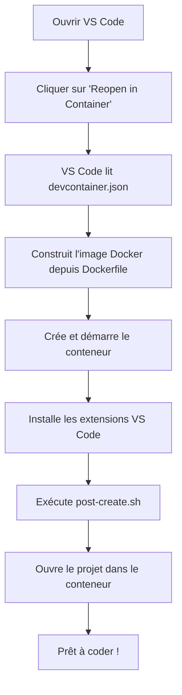

🔝 Retour au [Sommaire](/SOMMAIRE.md)

# C.4 - .devcontainer.json complet

## Table des matières
- [Introduction](#introduction)
- [Qu'est-ce qu'un DevContainer ?](#quest-ce-quun-devcontainer-)
- [Pourquoi utiliser des DevContainers ?](#pourquoi-utiliser-des-devcontainers-)
- [Prérequis et installation](#pr%C3%A9requis-et-installation)
- [Structure d'un DevContainer](#structure-dun-devcontainer)
- [Le fichier .devcontainer.json](#le-fichier-devcontainerjson)
- [Configuration complète commentée](#configuration-compl%C3%A8te-comment%C3%A9e)
- [Dockerfile pour C](#dockerfile-pour-c)
- [Extensions VS Code recommandées](#extensions-vs-code-recommand%C3%A9es)
- [Scripts de post-création](#scripts-de-post-cr%C3%A9ation)
- [Configurations par cas d'usage](#configurations-par-cas-dusage)
- [Utilisation du DevContainer](#utilisation-du-devcontainer)
- [Personnalisation avancée](#personnalisation-avanc%C3%A9e)
- [Intégration avec Git et CI/CD](#int%C3%A9gration-avec-git-et-cicd)
- [Dépannage](#d%C3%A9pannage)
- [Bonnes pratiques](#bonnes-pratiques)

---

## Introduction

Les DevContainers (Development Containers) révolutionnent la manière dont nous configurons et partageons nos environnements de développement. Plutôt que de dire "ça marche sur ma machine", vous pouvez maintenant garantir que tout le monde travaille dans le même environnement reproductible.

**Ce que vous allez apprendre :**
- Créer un environnement de développement C isolé et reproductible
- Configurer automatiquement tous les outils (GCC, GDB, CMake, Valgrind, etc.)
- Partager facilement votre configuration avec votre équipe
- Éliminer les problèmes de "ça marche sur ma machine"

---

## Qu'est-ce qu'un DevContainer ?

### **Définition**

Un **DevContainer** est un conteneur Docker spécialement configuré pour le développement. Il contient :
- Votre système d'exploitation (généralement Ubuntu)
- Tous vos outils de développement (compilateur, debugger, etc.)
- Vos extensions VS Code
- Vos configurations personnalisées

**Analogie simple :** Imaginez une machine virtuelle ultra-légère qui démarre en quelques secondes et contient exactement tous les outils dont vous avez besoin pour programmer en C, rien de plus, rien de moins.

### **Schéma conceptuel**

```
┌─────────────────────────────────────────┐
│        Votre machine physique           │
│  ┌───────────────────────────────────┐  │
│  │     VS Code (sur votre machine)   │  │
│  └───────────────┬───────────────────┘  │
│                  │ Connexion            │
│  ┌───────────────▼───────────────────┐  │
│  │       DevContainer (Docker)       │  │
│  │  ┌─────────────────────────────┐  │  │
│  │  │  Ubuntu 22.04               │  │  │
│  │  │  + GCC 11                   │  │  │
│  │  │  + GDB                      │  │  │
│  │  │  + CMake                    │  │  │
│  │  │  + Valgrind                 │  │  │
│  │  │  + Votre code source        │  │  │
│  │  └─────────────────────────────┘  │  │
│  └───────────────────────────────────┘  │
└─────────────────────────────────────────┘
```

### **Différence avec Docker classique**

| Aspect | Docker classique | DevContainer |
|--------|------------------|--------------|
| **Objectif** | Déployer des applications | Développer des applications |
| **Utilisation** | Ligne de commande | Intégré dans VS Code |
| **Expérience** | Terminal dans le conteneur | VS Code complet avec GUI |
| **Extensions** | Non gérées | Automatiquement installées |
| **Persistance** | Volumes Docker | Dossier de projet monté |

---

## Pourquoi utiliser des DevContainers ?

### **Avantages individuels**

✅ **Environnement propre et isolé**
- Pas de pollution de votre système principal
- Testez différentes versions de GCC facilement
- Supprimez et recréez en quelques secondes

✅ **Reproductibilité garantie**
- Même environnement sur Linux, Windows, macOS
- Même environnement en 2025 qu'en 2030 (si vous gardez le Dockerfile)

✅ **Configuration automatisée**
- Tous les outils installés automatiquement
- Extensions VS Code pré-configurées
- Paramètres prêts à l'emploi

✅ **Expérimentation sans risque**
- Cassez ce que vous voulez, recréez en 30 secondes
- Testez des configurations sans toucher à votre système

### **Avantages en équipe**

👥 **Onboarding ultra-rapide**
```bash
# Nouveau développeur :
git clone https://github.com/projet.git
code .
# VS Code propose d'ouvrir dans un DevContainer
# Clic sur "Reopen in Container"
# → Environnement complet prêt en 2 minutes !
```

👥 **Plus de "ça marche sur ma machine"**
- Tout le monde a exactement le même environnement
- Même version de GCC, même configuration
- Les bugs sont reproductibles

👥 **Standards d'équipe appliqués automatiquement**
- Extensions imposées (clang-format, linters, etc.)
- Configuration partagée
- Workflow uniforme

### **Cas d'usage concrets**

🎯 **Projet universitaire**
- L'enseignant fournit un DevContainer
- Tous les étudiants ont le bon environnement
- Pas de "GCC ne compile pas chez moi"

🎯 **Projet open-source**
- Les contributeurs peuvent démarrer instantanément
- Environnement de développement documenté comme code
- Réduction des barrières à la contribution

🎯 **Développement professionnel**
- Environnement de dev identique à la production
- Changez de projet sans reconfigurer votre machine
- CI/CD utilise le même environnement

---

## Prérequis et installation

### **1. Installer Docker**

#### **Sur Ubuntu/Debian**

```bash
# Mise à jour des paquets
sudo apt update

# Installation des dépendances
sudo apt install -y apt-transport-https ca-certificates curl software-properties-common

# Ajout de la clé GPG officielle de Docker
curl -fsSL https://download.docker.com/linux/ubuntu/gpg | sudo gpg --dearmor -o /usr/share/keyrings/docker-archive-keyring.gpg

# Ajout du dépôt Docker
echo "deb [arch=amd64 signed-by=/usr/share/keyrings/docker-archive-keyring.gpg] https://download.docker.com/linux/ubuntu $(lsb_release -cs) stable" | sudo tee /etc/apt/sources.list.d/docker.list > /dev/null

# Installation de Docker
sudo apt update
sudo apt install -y docker-ce docker-ce-cli containerd.io

# Vérification
sudo docker --version
```

#### **Ajouter votre utilisateur au groupe Docker**

```bash
# Ajouter votre utilisateur au groupe docker (pour éviter sudo)
sudo usermod -aG docker $USER

# Appliquer les changements (ou redémarrer)
newgrp docker

# Tester
docker run hello-world
```

**Résultat attendu :**
```
Hello from Docker!
This message shows that your installation appears to be working correctly.
```

### **2. Installer VS Code**

```bash
# Télécharger le paquet .deb depuis https://code.visualstudio.com/
# Ou installer via snap
sudo snap install --classic code
```

### **3. Installer l'extension Dev Containers**

**Méthode 1 : Interface VS Code**
1. Ouvrez VS Code
2. `Ctrl+Shift+X` (Extensions)
3. Recherchez "Dev Containers"
4. Cliquez sur "Install" (Extension officielle Microsoft)

**Méthode 2 : Ligne de commande**
```bash
code --install-extension ms-vscode-remote.remote-containers
```

### **Vérification complète**

```bash
# Vérifier Docker
docker --version
docker ps

# Vérifier VS Code
code --version

# Vérifier l'extension
code --list-extensions | grep remote-containers
```

---

## Structure d'un DevContainer

### **Arborescence typique**

```
mon_projet_c/
├── .devcontainer/
│   ├── devcontainer.json       ← Configuration principale
│   ├── Dockerfile              ← Image Docker personnalisée
│   ├── docker-compose.yml      ← (Optionnel) Pour services multiples
│   └── post-create.sh          ← Script exécuté après création
├── .vscode/
│   └── settings.json           ← Settings VS Code (projet)
├── src/
│   └── main.c
├── include/
│   └── utils.h
├── CMakeLists.txt
└── README.md
```

### **Fichiers essentiels**

**1. `.devcontainer/devcontainer.json`**
- Configuration du conteneur
- Extensions à installer
- Paramètres VS Code
- Scripts à exécuter

**2. `.devcontainer/Dockerfile` (optionnel)**
- Image Docker personnalisée
- Installation des outils (GCC, GDB, etc.)
- Configuration système

**3. `.devcontainer/post-create.sh` (optionnel)**
- Script exécuté après la création du conteneur
- Installation de dépendances supplémentaires
- Configuration initiale

### **Workflow de création**



---

## Le fichier .devcontainer.json

### **Structure de base**

Le fichier `.devcontainer/devcontainer.json` utilise le format JSON. Voici sa structure minimale :

```json
{
  "name": "Nom du conteneur",
  "image": "ubuntu:22.04",
  "customizations": {
    "vscode": {
      "extensions": ["ms-vscode.cpptools"]
    }
  }
}
```

### **Options principales**

| Option | Description | Exemple |
|--------|-------------|---------|
| `name` | Nom du DevContainer | `"C Development"` |
| `image` | Image Docker de base | `"ubuntu:22.04"` |
| `build.dockerfile` | Chemin vers Dockerfile | `"Dockerfile"` |
| `customizations.vscode.extensions` | Extensions VS Code | `["ms-vscode.cpptools"]` |
| `customizations.vscode.settings` | Settings VS Code | `{"editor.tabSize": 4}` |
| `postCreateCommand` | Commande après création | `"make"` |
| `forwardPorts` | Ports exposés | `[8080, 3000]` |
| `mounts` | Volumes Docker | Configuration avancée |
| `features` | Fonctionnalités préconfigurées | `{"ghcr.io/devcontainers/features/git:1": {}}` |

### **Syntaxe JSON : Rappels importants**

```json
{
  "cle": "valeur",              // Chaîne de caractères
  "nombre": 42,                 // Nombre
  "booleen": true,              // Booléen (true/false)
  "tableau": ["a", "b", "c"],   // Tableau
  "objet": {                    // Objet imbriqué
    "sous_cle": "sous_valeur"
  }
}
// Pas de virgule après le dernier élément !
```

---

## Configuration complète commentée

Voici une configuration `.devcontainer/devcontainer.json` complète et commentée pour un projet C professionnel :

```json
{
  // ============================================
  // CONFIGURATION DEVCONTAINER POUR PROJET C
  // Édition 2025 - Environnement complet
  // ============================================

  // -------------------- INFORMATIONS DE BASE --------------------

  // Nom du DevContainer (affiché dans VS Code)
  "name": "C Development Environment (Ubuntu 22.04)",

  // Utiliser un Dockerfile personnalisé
  "build": {
    "dockerfile": "Dockerfile",
    "context": ".",
    // Arguments pour le Dockerfile
    "args": {
      "VARIANT": "22.04",
      "GCC_VERSION": "11"
    }
  },

  // Alternative : utiliser une image prête à l'emploi
  // "image": "mcr.microsoft.com/devcontainers/cpp:ubuntu-22.04",

  // -------------------- FONCTIONNALITÉS DEVCONTAINER --------------------

  // Features : Composants préconfigurés installables automatiquement
  // Voir : https://containers.dev/features
  "features": {
    // Git (avec options)
    "ghcr.io/devcontainers/features/git:1": {
      "version": "latest",
      "ppa": true
    },
    // GitHub CLI
    "ghcr.io/devcontainers/features/github-cli:1": {},
    // Common utilities (curl, wget, etc.)
    "ghcr.io/devcontainers/features/common-utils:2": {
      "installZsh": true,
      "installOhMyZsh": true,
      "upgradePackages": true,
      "username": "vscode"
    },
    // Docker-in-Docker (pour construire des images Docker depuis le DevContainer)
    "ghcr.io/devcontainers/features/docker-in-docker:2": {
      "version": "latest",
      "dockerDashComposeVersion": "v2"
    }
  },

  // -------------------- PERSONNALISATION VS CODE --------------------

  "customizations": {
    "vscode": {
      // Extensions à installer automatiquement
      "extensions": [
        // C/C++ IntelliSense, debugging, and code browsing
        "ms-vscode.cpptools",
        "ms-vscode.cpptools-extension-pack",

        // CMake support
        "ms-vscode.cmake-tools",
        "twxs.cmake",

        // Makefile support
        "ms-vscode.makefile-tools",

        // Code formatting
        "xaver.clang-format",

        // Git integration
        "eamodio.gitlens",
        "donjayamanne.githistory",

        // Code quality
        "ms-vscode.hexeditor",
        "jeff-hykin.better-cpp-syntax",

        // Productivity
        "usernamehw.errorlens",
        "aaron-bond.better-comments",
        "streetsidesoftware.code-spell-checker",

        // Docker
        "ms-azuretools.vscode-docker",

        // Debugging
        "vadimcn.vscode-lldb",

        // Markdown
        "yzhang.markdown-all-in-one",

        // Themes (optionnel)
        "github.github-vscode-theme",
        "pkief.material-icon-theme"
      ],

      // Paramètres VS Code spécifiques au DevContainer
      "settings": {
        // ===== Éditeur =====
        "editor.formatOnSave": true,
        "editor.tabSize": 4,
        "editor.insertSpaces": true,
        "editor.rulers": [80, 120],
        "editor.fontFamily": "'Fira Code', monospace",
        "editor.fontLigatures": true,
        "editor.lineNumbers": "on",
        "editor.renderWhitespace": "boundary",
        "editor.bracketPairColorization.enabled": true,

        // ===== Fichiers =====
        "files.trimTrailingWhitespace": true,
        "files.insertFinalNewline": true,
        "files.encoding": "utf8",
        "files.eol": "\n",
        "files.autoSave": "afterDelay",

        // ===== C/C++ Extension =====
        "C_Cpp.default.cStandard": "c11",
        "C_Cpp.default.compilerPath": "/usr/bin/gcc",
        "C_Cpp.default.intelliSenseMode": "linux-gcc-x64",
        "C_Cpp.clang_format_style": "file",
        "C_Cpp.errorSquiggles": "enabled",
        "C_Cpp.enhancedColorization": "enabled",

        // ===== CMake =====
        "cmake.configureOnOpen": false,
        "cmake.buildDirectory": "${workspaceFolder}/build",
        "cmake.generator": "Unix Makefiles",

        // ===== Terminal =====
        "terminal.integrated.defaultProfile.linux": "bash",
        "terminal.integrated.scrollback": 10000,

        // ===== Git =====
        "git.autofetch": true,
        "git.confirmSync": false,

        // ===== Recherche =====
        "search.exclude": {
          "**/build": true,
          "**/dist": true,
          "**/.git": true,
          "**/*.o": true,
          "**/*.a": true
        },

        // ===== Formatage =====
        "[c]": {
          "editor.defaultFormatter": "ms-vscode.cpptools"
        }
      }
    }
  },

  // -------------------- COMMANDES ET SCRIPTS --------------------

  // Commande exécutée une seule fois après la création du conteneur
  "postCreateCommand": "bash .devcontainer/post-create.sh",

  // Commande exécutée à chaque démarrage du conteneur
  "postStartCommand": "echo '✅ DevContainer démarré avec succès !'",

  // Commande exécutée à chaque attachement au conteneur
  "postAttachCommand": "git status",

  // -------------------- CONFIGURATION RÉSEAU --------------------

  // Ports à exposer (forwarding automatique)
  "forwardPorts": [
    8080,  // Serveur HTTP potentiel
    3000   // Autre service
  ],

  // Noms des ports (affichés dans VS Code)
  "portsAttributes": {
    "8080": {
      "label": "HTTP Server",
      "onAutoForward": "notify"
    },
    "3000": {
      "label": "Debug Server",
      "onAutoForward": "silent"
    }
  },

  // -------------------- MONTAGE DE VOLUMES --------------------

  "mounts": [
    // Monter le socket Docker (pour Docker-in-Docker)
    "source=/var/run/docker.sock,target=/var/run/docker.sock,type=bind",

    // Cache pour apt (accélère les rebuilds)
    "source=devcontainer-apt-cache,target=/var/cache/apt,type=volume",

    // Historique bash persistant
    "source=devcontainer-bash-history,target=/commandhistory,type=volume"
  ],

  // -------------------- CONFIGURATION UTILISATEUR --------------------

  // Utilisateur par défaut dans le conteneur
  "remoteUser": "vscode",

  // Variables d'environnement
  "remoteEnv": {
    "CC": "gcc",
    "CXX": "g++",
    "CFLAGS": "-Wall -Wextra -std=c11",
    "PATH": "${containerEnv:PATH}:/usr/local/bin"
  },

  // -------------------- OPTIONS DOCKER --------------------

  // Options supplémentaires pour docker run
  "runArgs": [
    "--cap-add=SYS_PTRACE",  // Nécessaire pour GDB
    "--security-opt=seccomp=unconfined"  // Désactive seccomp (utile pour le débogage)
  ],

  // Privilèges (éviter si possible)
  // "privileged": false,

  // -------------------- AUTRES OPTIONS --------------------

  // Conserver le conteneur après fermeture de VS Code
  "shutdownAction": "stopContainer",
  // Autres options : "none" (garder en vie), "stopCompose"

  // Contexte de build Docker
  "workspaceFolder": "/workspace",

  // Workspace mount (où monter le code source)
  "workspaceMount": "source=${localWorkspaceFolder},target=/workspace,type=bind,consistency=cached"
}
```

---

## Dockerfile pour C

Le Dockerfile définit l'environnement système. Voici une configuration complète pour le développement C :

### **Dockerfile de base**

`.devcontainer/Dockerfile` :

```dockerfile
# ============================================
# Dockerfile pour environnement de développement C
# Base : Ubuntu 22.04
# ============================================

# Image de base
ARG VARIANT=22.04
FROM ubuntu:${VARIANT}

# Éviter les prompts interactifs
ARG DEBIAN_FRONTEND=noninteractive

# Arguments de build
ARG GCC_VERSION=11
ARG USERNAME=vscode
ARG USER_UID=1000
ARG USER_GID=$USER_UID

# -------------------- LABELS --------------------

LABEL maintainer="votre-email@example.com"
LABEL description="Environnement de développement C complet"
LABEL version="1.0"

# -------------------- INSTALLATION DES OUTILS DE BASE --------------------

RUN apt-get update && apt-get install -y \
    # Outils système de base
    apt-utils \
    ca-certificates \
    curl \
    wget \
    gnupg \
    lsb-release \
    software-properties-common \
    # Outils shell
    bash-completion \
    zsh \
    git \
    vim \
    nano \
    # Outils de build
    build-essential \
    make \
    cmake \
    ninja-build \
    automake \
    autoconf \
    libtool \
    pkg-config \
    # Compilateurs et debuggers
    gcc-${GCC_VERSION} \
    g++-${GCC_VERSION} \
    gdb \
    gdbserver \
    lldb \
    clang \
    clang-format \
    clang-tidy \
    # Outils d'analyse
    valgrind \
    cppcheck \
    vera++ \
    # Outils de profiling
    perf \
    linux-tools-generic \
    # Bibliothèques de développement courantes
    libssl-dev \
    libcurl4-openssl-dev \
    libpthread-stubs0-dev \
    zlib1g-dev \
    # Outils réseau et système
    net-tools \
    iputils-ping \
    dnsutils \
    strace \
    ltrace \
    # Documentation
    man-db \
    manpages-dev \
    && rm -rf /var/lib/apt/lists/*

# -------------------- CONFIGURATION GCC --------------------

# Définir GCC comme compilateur par défaut
RUN update-alternatives --install /usr/bin/gcc gcc /usr/bin/gcc-${GCC_VERSION} 100 \
    && update-alternatives --install /usr/bin/g++ g++ /usr/bin/g++-${GCC_VERSION} 100 \
    && update-alternatives --install /usr/bin/gcov gcov /usr/bin/gcov-${GCC_VERSION} 100

# -------------------- CRÉATION DE L'UTILISATEUR --------------------

RUN groupadd --gid $USER_GID $USERNAME \
    && useradd --uid $USER_UID --gid $USER_GID -m -s /bin/bash $USERNAME \
    # Ajouter au groupe sudo
    && apt-get update \
    && apt-get install -y sudo \
    && echo $USERNAME ALL=\(root\) NOPASSWD:ALL > /etc/sudoers.d/$USERNAME \
    && chmod 0440 /etc/sudoers.d/$USERNAME \
    && rm -rf /var/lib/apt/lists/*

# -------------------- INSTALLATION D'OUTILS SUPPLÉMENTAIRES --------------------

# Installation de lcov pour la couverture de code
RUN apt-get update && apt-get install -y lcov \
    && rm -rf /var/lib/apt/lists/*

# Installation de criterion (framework de tests)
RUN cd /tmp \
    && git clone --recursive https://github.com/Snaipe/Criterion \
    && cd Criterion \
    && cmake -S . -B build -DCMAKE_INSTALL_PREFIX=/usr/local \
    && cmake --build build --target install \
    && cd / && rm -rf /tmp/Criterion

# -------------------- CONFIGURATION SHELL --------------------

# Configuration de bash pour l'utilisateur
USER $USERNAME
WORKDIR /home/$USERNAME

# Historique bash persistant
RUN SNIPPET="export PROMPT_COMMAND='history -a' && export HISTFILE=/commandhistory/.bash_history" \
    && mkdir -p /commandhistory \
    && touch /commandhistory/.bash_history \
    && chown -R $USERNAME:$USERNAME /commandhistory \
    && echo "$SNIPPET" >> "/home/$USERNAME/.bashrc"

# Alias utiles
RUN echo 'alias ll="ls -lah"' >> ~/.bashrc \
    && echo 'alias gs="git status"' >> ~/.bashrc \
    && echo 'alias gd="git diff"' >> ~/.bashrc \
    && echo 'alias gc="git commit"' >> ~/.bashrc \
    && echo 'alias gp="git push"' >> ~/.bashrc \
    && echo 'alias gl="git log --oneline --graph"' >> ~/.bashrc

# -------------------- CONFIGURATION GIT --------------------

RUN git config --global init.defaultBranch main \
    && git config --global core.editor vim

# -------------------- VARIABLES D'ENVIRONNEMENT --------------------

ENV CC=gcc
ENV CXX=g++
ENV CFLAGS="-Wall -Wextra -std=c11"
ENV CXXFLAGS="-Wall -Wextra -std=c++17"

# -------------------- WORKSPACE --------------------

# Créer le dossier workspace
USER root
RUN mkdir -p /workspace && chown -R $USERNAME:$USERNAME /workspace

USER $USERNAME
WORKDIR /workspace

# -------------------- COMMANDE PAR DÉFAUT --------------------

CMD ["/bin/bash"]
```

### **Dockerfile minimal (pour débuter)**

Si vous préférez commencer simple :

```dockerfile
FROM ubuntu:22.04

RUN apt-get update && apt-get install -y \
    gcc \
    gdb \
    make \
    cmake \
    git \
    valgrind \
    && rm -rf /var/lib/apt/lists/*

WORKDIR /workspace
```

---

## Extensions VS Code recommandées

### **Extensions essentielles**

```json
"extensions": [
  // C/C++ de base
  "ms-vscode.cpptools",
  "ms-vscode.cpptools-extension-pack",

  // Build systems
  "ms-vscode.cmake-tools",
  "ms-vscode.makefile-tools",

  // Formatage
  "xaver.clang-format",

  // Git
  "eamodio.gitlens",

  // Qualité de code
  "usernamehw.errorlens",
  "aaron-bond.better-comments"
]
```

### **Extensions avancées**

```json
"extensions": [
  // Debugging avancé
  "vadimcn.vscode-lldb",

  // Documentation
  "cschlosser.doxdocgen",

  // Hex editor (pour debug bas niveau)
  "ms-vscode.hexeditor",

  // Performance profiling
  "ms-vscode.vscode-perf",

  // Diagrammes
  "hediet.vscode-drawio",

  // Collaboration
  "ms-vsliveshare.vsliveshare"
]
```

---

## Scripts de post-création

Le script `post-create.sh` s'exécute après la création du conteneur. Il permet de :
- Installer des dépendances supplémentaires
- Configurer des outils
- Initialiser le projet

### **Script post-create.sh de base**

`.devcontainer/post-create.sh` :

```bash
#!/bin/bash
# ============================================
# Script de post-création du DevContainer
# ============================================

set -e  # Arrêter en cas d'erreur

echo "🚀 Exécution du script de post-création..."

# -------------------- MISE À JOUR DU SYSTÈME --------------------

echo "📦 Mise à jour des paquets système..."
sudo apt-get update

# -------------------- INSTALLATION DE DÉPENDANCES PROJET --------------------

echo "📚 Installation des dépendances du projet..."

# Installer des bibliothèques spécifiques à votre projet
# sudo apt-get install -y libcunit1-dev

# -------------------- CONFIGURATION GIT --------------------

echo "🔧 Configuration de Git..."

# Vérifier si Git est configuré
if [ -z "$(git config --global user.name)" ]; then
    echo "⚠️  Git user.name non configuré. Pensez à le configurer :"
    echo "   git config --global user.name 'Votre Nom'"
fi

if [ -z "$(git config --global user.email)" ]; then
    echo "⚠️  Git user.email non configuré. Pensez à le configurer :"
    echo "   git config --global user.email 'votre.email@example.com'"
fi

# -------------------- VÉRIFICATION DES OUTILS --------------------

echo "✅ Vérification des outils installés..."

# Vérifier GCC
if command -v gcc &> /dev/null; then
    echo "   GCC version : $(gcc --version | head -n1)"
else
    echo "   ❌ GCC non trouvé"
fi

# Vérifier GDB
if command -v gdb &> /dev/null; then
    echo "   GDB version : $(gdb --version | head -n1)"
else
    echo "   ❌ GDB non trouvé"
fi

# Vérifier CMake
if command -v cmake &> /dev/null; then
    echo "   CMake version : $(cmake --version | head -n1)"
else
    echo "   ❌ CMake non trouvé"
fi

# Vérifier Valgrind
if command -v valgrind &> /dev/null; then
    echo "   Valgrind version : $(valgrind --version)"
else
    echo "   ❌ Valgrind non trouvé"
fi

# -------------------- BUILD INITIAL (optionnel) --------------------

# Si vous voulez compiler automatiquement au démarrage
# echo "🔨 Compilation initiale du projet..."
# if [ -f "CMakeLists.txt" ]; then
#     mkdir -p build
#     cd build
#     cmake ..
#     make
#     cd ..
#     echo "   ✅ Compilation réussie"
# elif [ -f "Makefile" ]; then
#     make
#     echo "   ✅ Compilation réussie"
# fi

# -------------------- CRÉATION DE RACCOURCIS --------------------

echo "🔗 Création d'alias utiles..."

# Ajouter des alias dans .bashrc (si pas déjà présents)
if ! grep -q "# Custom DevContainer aliases" ~/.bashrc; then
    cat >> ~/.bashrc << 'EOF'

# Custom DevContainer aliases
alias compile='gcc -Wall -Wextra -std=c11 -g'
alias valgrind-check='valgrind --leak-check=full --show-leak-kinds=all --track-origins=yes'
alias clean='rm -rf build *.o *.out a.out'

EOF
fi

# -------------------- MESSAGE DE BIENVENUE --------------------

echo ""
echo "╔═══════════════════════════════════════════════════════════╗"
echo "║                                                           ║"
echo "║   ✅  DevContainer configuré avec succès !                ║"
echo "║                                                           ║"
echo "║   Outils disponibles :                                    ║"
echo "║   • GCC $(gcc --version | head -n1 | awk '{print $3}')                                            ║"
echo "║   • GDB pour le débogage                                  ║"
echo "║   • CMake pour le build                                   ║"
echo "║   • Valgrind pour l'analyse mémoire                       ║"
echo "║                                                           ║"
echo "║   Commandes utiles :                                      ║"
echo "║   • compile main.c    : Compiler avec les bons flags      ║"
echo "║   • valgrind-check    : Vérifier les fuites mémoire       ║"
echo "║   • clean             : Nettoyer les fichiers générés     ║"
echo "║                                                           ║"
echo "║   Bon développement ! 🚀                                  ║"
echo "║                                                           ║"
echo "╚═══════════════════════════════════════════════════════════╝"
echo ""

# -------------------- FIN --------------------

exit 0
```

**Rendre le script exécutable :**

```bash
chmod +x .devcontainer/post-create.sh
```

### **Script post-create.sh avancé**

Pour des projets plus complexes :

```bash
#!/bin/bash
set -e

echo "🚀 Configuration avancée du DevContainer..."

# Installation de bibliothèques spécifiques
sudo apt-get update && sudo apt-get install -y \
    libcunit1-dev \
    libcheck-dev \
    libssl-dev \
    libcurl4-openssl-dev

# Installation d'outils Python pour des scripts auxiliaires
pip3 install --user conan meson

# Configuration de pre-commit hooks
if [ -f ".pre-commit-config.yaml" ]; then
    pip3 install --user pre-commit
    pre-commit install
fi

# Génération de compile_commands.json pour IntelliSense
if [ -f "CMakeLists.txt" ]; then
    mkdir -p build
    cd build
    cmake -DCMAKE_EXPORT_COMPILE_COMMANDS=ON ..
    cd ..
fi

echo "✅ Configuration avancée terminée !"
```

---

## Configurations par cas d'usage

### **Configuration 1 : Projet universitaire simple**

`.devcontainer/devcontainer.json` :

```json
{
  "name": "C Débutant",
  "image": "ubuntu:22.04",
  "features": {
    "ghcr.io/devcontainers/features/common-utils:2": {}
  },
  "postCreateCommand": "apt-get update && apt-get install -y gcc gdb make",
  "customizations": {
    "vscode": {
      "extensions": [
        "ms-vscode.cpptools"
      ],
      "settings": {
        "editor.formatOnSave": true,
        "C_Cpp.default.cStandard": "c11"
      }
    }
  }
}
```

### **Configuration 2 : Projet avec CMake**

```json
{
  "name": "C avec CMake",
  "build": {
    "dockerfile": "Dockerfile"
  },
  "customizations": {
    "vscode": {
      "extensions": [
        "ms-vscode.cpptools",
        "ms-vscode.cmake-tools",
        "twxs.cmake"
      ],
      "settings": {
        "cmake.configureOnOpen": true,
        "cmake.buildDirectory": "${workspaceFolder}/build"
      }
    }
  },
  "postCreateCommand": "mkdir -p build && cd build && cmake .."
}
```

### **Configuration 3 : Développement système (eBPF, kernel)**

```json
{
  "name": "C Système Linux",
  "build": {
    "dockerfile": "Dockerfile",
    "args": {
      "VARIANT": "22.04"
    }
  },
  "runArgs": [
    "--privileged",
    "--cap-add=SYS_ADMIN",
    "--cap-add=NET_ADMIN"
  ],
  "customizations": {
    "vscode": {
      "extensions": [
        "ms-vscode.cpptools",
        "ms-vscode.hexeditor"
      ]
    }
  },
  "mounts": [
    "source=/lib/modules,target=/lib/modules,type=bind,readonly"
  ]
}
```

### **Configuration 4 : Projet avec tests automatisés**

```json
{
  "name": "C avec Tests (Criterion)",
  "build": {
    "dockerfile": "Dockerfile"
  },
  "customizations": {
    "vscode": {
      "extensions": [
        "ms-vscode.cpptools",
        "ms-vscode.cmake-tools",
        "hbenl.vscode-test-explorer"
      ]
    }
  },
  "postCreateCommand": "bash .devcontainer/post-create.sh",
  "features": {
    "ghcr.io/devcontainers/features/github-cli:1": {}
  }
}
```

### **Configuration 5 : Multi-services avec docker-compose**

`.devcontainer/docker-compose.yml` :

```yaml
version: '3.8'

services:
  app:
    build:
      context: .
      dockerfile: Dockerfile
    volumes:
      - ..:/workspace:cached
    command: sleep infinity
    depends_on:
      - database

  database:
    image: postgres:15
    restart: unless-stopped
    environment:
      POSTGRES_PASSWORD: dev_password
      POSTGRES_USER: dev_user
      POSTGRES_DB: dev_db
    ports:
      - "5432:5432"
```

`.devcontainer/devcontainer.json` :

```json
{
  "name": "C avec PostgreSQL",
  "dockerComposeFile": "docker-compose.yml",
  "service": "app",
  "workspaceFolder": "/workspace",
  "customizations": {
    "vscode": {
      "extensions": [
        "ms-vscode.cpptools",
        "ms-azuretools.vscode-docker"
      ]
    }
  }
}
```

---

## Utilisation du DevContainer

### **Première utilisation**

1. **Ouvrir le projet dans VS Code**
   ```bash
   cd mon_projet_c
   code .
   ```

2. **VS Code détecte le DevContainer**
   - Une notification apparaît : "Folder contains a Dev Container configuration file"
   - Cliquez sur **"Reopen in Container"**

3. **VS Code construit le conteneur**
   - Construction de l'image Docker (première fois : 2-5 minutes)
   - Création et démarrage du conteneur
   - Installation des extensions
   - Exécution du script post-create

4. **Vous êtes prêt !**
   - Le terminal est dans le conteneur
   - Les extensions sont installées
   - L'environnement est configuré

### **Commandes de la palette**

Ouvrez la palette de commandes (`Ctrl+Shift+P`) et tapez "Dev Containers" :

| Commande | Description |
|----------|-------------|
| `Reopen in Container` | Ouvrir le dossier dans le DevContainer |
| `Rebuild Container` | Reconstruire le conteneur (après modification du Dockerfile) |
| `Rebuild Without Cache` | Reconstruction complète (ignore le cache Docker) |
| `Reopen Folder Locally` | Revenir à l'environnement local |
| `Open Container Configuration` | Ouvrir devcontainer.json |
| `Show Container Log` | Afficher les logs du conteneur |
| `Attach to Running Container` | Se connecter à un conteneur existant |

### **Workflow quotidien**

**Lancer le DevContainer :**
```bash
code .
# Cliquer sur "Reopen in Container" si pas déjà dans le conteneur
```

**Vérifier que vous êtes dans le conteneur :**
```bash
# Le prompt devrait indiquer le nom du conteneur
vscode@abc123:/workspace$

# Vérifier avec uname
uname -a
# → Linux abc123... (version du kernel du conteneur)
```

**Compiler et exécuter :**
```bash
gcc -Wall -Wextra main.c -o main
./main
```

**Quitter :**
- Fermez simplement VS Code
- Le conteneur s'arrête automatiquement (selon `shutdownAction`)

### **Accéder au conteneur depuis le terminal externe**

Si vous voulez accéder au conteneur depuis un terminal en dehors de VS Code :

```bash
# Lister les conteneurs en cours
docker ps

# Se connecter au conteneur (remplacer CONTAINER_ID)
docker exec -it CONTAINER_ID bash

# Ou utiliser le nom du conteneur
docker exec -it mon_projet_c-dev bash
```

---

## Personnalisation avancée

### **Persister l'historique bash**

Pour garder l'historique de vos commandes entre les sessions :

**Dans devcontainer.json :**
```json
"mounts": [
  "source=devcontainer-bash-history,target=/commandhistory,type=volume"
]
```

**Dans Dockerfile :**
```dockerfile
RUN SNIPPET="export PROMPT_COMMAND='history -a' && export HISTFILE=/commandhistory/.bash_history" \
    && mkdir -p /commandhistory \
    && touch /commandhistory/.bash_history \
    && echo "$SNIPPET" >> "/home/vscode/.bashrc"
```

### **Accélérer les rebuilds avec des caches**

```json
"mounts": [
  // Cache apt pour ne pas retélécharger les paquets
  "source=devcontainer-apt-cache,target=/var/cache/apt,type=volume",

  // Cache pip
  "source=devcontainer-pip-cache,target=/home/vscode/.cache/pip,type=volume"
]
```

### **Partager le socket Docker (Docker-in-Docker)**

Pour utiliser Docker depuis le DevContainer :

```json
"mounts": [
  "source=/var/run/docker.sock,target=/var/run/docker.sock,type=bind"
],
"features": {
  "ghcr.io/devcontainers/features/docker-in-docker:2": {}
}
```

### **Variables d'environnement personnalisées**

```json
"remoteEnv": {
  "PROJECT_NAME": "mon_projet",
  "BUILD_TYPE": "Debug",
  "LOG_LEVEL": "INFO"
}
```

**Utilisation dans le code :**
```c
#include <stdlib.h>
#include <stdio.h>

int main() {
    char *project = getenv("PROJECT_NAME");
    printf("Projet : %s\n", project);
    return 0;
}
```

### **Configuration GPU (pour CUDA, OpenCL, etc.)**

```json
"runArgs": [
  "--gpus=all"
],
"containerEnv": {
  "NVIDIA_VISIBLE_DEVICES": "all",
  "NVIDIA_DRIVER_CAPABILITIES": "compute,utility"
}
```

### **Ports personnalisés et port forwarding**

```json
"forwardPorts": [8080, 3000],
"portsAttributes": {
  "8080": {
    "label": "Application Web",
    "onAutoForward": "notify",
    "protocol": "https"
  },
  "3000": {
    "label": "Debug Server",
    "onAutoForward": "silent"
  }
}
```

### **Overrides par utilisateur**

Chaque développeur peut avoir ses propres overrides sans modifier le fichier principal.

**Créer `.devcontainer/devcontainer.local.json` (ne pas commiter) :**

```json
{
  "customizations": {
    "vscode": {
      "extensions": [
        "github.copilot"  // Extension personnelle
      ],
      "settings": {
        "editor.fontSize": 16  // Taille de police personnelle
      }
    }
  }
}
```

**Ajouter au .gitignore :**
```
.devcontainer/devcontainer.local.json
```

---

## Intégration avec Git et CI/CD

### **Fichiers à commiter**

```bash
# À commiter
.devcontainer/
├── devcontainer.json      ✅
├── Dockerfile             ✅
├── post-create.sh         ✅
└── docker-compose.yml     ✅

# À ignorer
.devcontainer/
└── devcontainer.local.json  ❌
```

**.gitignore :**
```
# DevContainer local overrides
.devcontainer/devcontainer.local.json

# Volumes Docker
.devcontainer/.volumes/
```

### **Documentation dans le README**

Ajoutez une section dans votre `README.md` :

```markdown
## 🐳 Développement avec DevContainer

Ce projet utilise un DevContainer pour garantir un environnement de développement cohérent.

### Prérequis
- Docker
- VS Code avec l'extension "Dev Containers"

### Démarrage rapide

1. Clonez le repository :
   ```bash
   git clone https://github.com/username/projet.git
   cd projet
   ```

2. Ouvrez dans VS Code :
   ```bash
   code .
   ```

3. Quand VS Code demande, cliquez sur **"Reopen in Container"**

4. Attendez que le conteneur se construise (2-5 minutes la première fois)

5. Vous êtes prêt ! Le terminal est dans le conteneur avec tous les outils installés.

### Outils inclus
- GCC 11
- GDB
- CMake
- Valgrind
- clang-format
- Extensions VS Code préconfigurées
```

### **Utiliser le même environnement en CI/CD**

Vous pouvez réutiliser votre Dockerfile en CI/CD pour garantir la cohérence.

**GitHub Actions :**

```yaml
name: CI

on: [push, pull_request]

jobs:
  build:
    runs-on: ubuntu-latest

    # Utiliser le même Dockerfile que le DevContainer
    container:
      image: ubuntu:22.04
      options: --user root

    steps:
    - uses: actions/checkout@v3

    - name: Install tools (same as Dockerfile)
      run: |
        apt-get update
        apt-get install -y gcc gdb cmake make valgrind

    - name: Build
      run: |
        mkdir build && cd build
        cmake ..
        make

    - name: Test
      run: |
        cd build
        ctest --output-on-failure
```

**Ou construire l'image Docker directement :**

```yaml
jobs:
  build:
    runs-on: ubuntu-latest

    steps:
    - uses: actions/checkout@v3

    - name: Build DevContainer image
      run: docker build -t dev-env .devcontainer

    - name: Run tests in container
      run: docker run --rm -v $PWD:/workspace dev-env make test
```

---

## Dépannage

### **Problème 1 : Le conteneur ne se construit pas**

**Erreur :**
```
Error: Failed to start container
```

**Solutions :**

**a) Vérifier que Docker fonctionne :**
```bash
docker ps
# Si erreur : démarrer le service Docker
sudo systemctl start docker
```

**b) Reconstruire sans cache :**
```
Ctrl+Shift+P → "Dev Containers: Rebuild Container Without Cache"
```

**c) Vérifier les logs :**
```bash
docker logs <container_id>
```

### **Problème 2 : Extensions non installées**

**Symptômes :** Les extensions ne sont pas présentes après l'ouverture du conteneur.

**Solutions :**

**a) Vérifier que les IDs sont corrects :**
```json
"extensions": [
  "ms-vscode.cpptools"  // ✅ Correct
  // Pas : "C/C++"       // ❌ Incorrect
]
```

**b) Réinstaller les extensions :**
```
Ctrl+Shift+P → "Dev Containers: Rebuild Container"
```

### **Problème 3 : Permissions insuffisantes**

**Erreur :**
```
Permission denied when trying to write to /workspace
```

**Solutions :**

**a) Vérifier l'utilisateur dans devcontainer.json :**
```json
"remoteUser": "vscode"
```

**b) Ajuster les permissions dans le Dockerfile :**
```dockerfile
RUN chown -R vscode:vscode /workspace
```

### **Problème 4 : GDB ne fonctionne pas**

**Erreur :**
```
warning: Error disabling address space randomization: Operation not permitted
```

**Solution :** Ajouter des capabilities dans devcontainer.json :
```json
"runArgs": [
  "--cap-add=SYS_PTRACE",
  "--security-opt=seccomp=unconfined"
]
```

### **Problème 5 : Le conteneur est trop lent**

**Causes possibles :**
- Trop d'outils installés
- Pas de cache utilisé
- Synchronisation de fichiers inefficace

**Solutions :**

**a) Utiliser des volumes nommés pour les caches :**
```json
"mounts": [
  "source=devcontainer-apt-cache,target=/var/cache/apt,type=volume"
]
```

**b) Optimiser le Dockerfile (mettre les layers qui changent peu en premier) :**
```dockerfile
# ✅ Bon ordre
FROM ubuntu:22.04
RUN apt-get update && apt-get install -y gcc  # Change rarement
COPY requirements.txt .                       # Change parfois
RUN pip install -r requirements.txt
COPY . .                                      # Change souvent

# ❌ Mauvais ordre
FROM ubuntu:22.04
COPY . .                                      # Change souvent → rebuild tout
RUN apt-get update && apt-get install -y gcc
```

**c) Utiliser un workspace mount avec "cached" :**
```json
"workspaceMount": "source=${localWorkspaceFolder},target=/workspace,type=bind,consistency=cached"
```

### **Problème 6 : Le script post-create échoue**

**Symptômes :** Le conteneur se construit mais le script ne s'exécute pas correctement.

**Solutions :**

**a) Vérifier que le script est exécutable :**
```bash
chmod +x .devcontainer/post-create.sh
git add .devcontainer/post-create.sh
git commit -m "Make post-create.sh executable"
```

**b) Ajouter des logs de débogage :**
```bash
#!/bin/bash
set -x  # Afficher chaque commande
echo "Début du script post-create"
# ... reste du script
```

**c) Vérifier les logs :**
```
Ctrl+Shift+P → "Dev Containers: Show Container Log"
```

---

## Bonnes pratiques

### **✅ À faire**

1. **Commiter le DevContainer**
   - Partagez la config avec l'équipe
   - Documentez dans le README

2. **Utiliser des images de base officielles**
   ```json
   "image": "ubuntu:22.04"  // ✅ Officiel
   // Pas : "random-user/custom-ubuntu"  // ❌ Non vérifié
   ```

3. **Minimiser le Dockerfile**
   - N'installez que ce qui est nécessaire
   - Nettoyez les caches apt (`rm -rf /var/lib/apt/lists/*`)

4. **Versionner les outils**
   ```dockerfile
   RUN apt-get install -y gcc-11  # ✅ Version spécifique
   # Pas : gcc                    # ❌ Version non contrôlée
   ```

5. **Utiliser des Features quand possible**
   ```json
   "features": {
     "ghcr.io/devcontainers/features/git:1": {}  // ✅ Maintenu
   }
   // Au lieu de : RUN apt-get install git      // ❌ Manuel
   ```

6. **Documenter les dépendances**
   ```json
   // Commentez pourquoi vous installez chaque outil
   "postCreateCommand": "sudo apt-get install -y libssl-dev  # Requis pour HTTPS"
   ```

### **❌ À éviter**

1. **Ne pas commiter de secrets**
   ```json
   // ❌ NE JAMAIS FAIRE :
   "remoteEnv": {
     "API_KEY": "sk-1234567890abcdef"  // Secret exposé !
   }

   // ✅ À la place, utiliser des variables d'environnement locales
   ```

2. **Ne pas utiliser `privileged: true` sauf nécessité**
   ```json
   // ❌ Éviter si possible
   "privileged": true

   // ✅ Préférer des capabilities spécifiques
   "runArgs": ["--cap-add=SYS_PTRACE"]
   ```

3. **Ne pas installer trop d'extensions**
   - Ralentit le démarrage
   - Complexifie l'environnement
   - Limite aux extensions essentielles au projet

4. **Ne pas oublier .dockerignore**
   ```
   # .dockerignore
   .git
   build/
   *.o
   *.out
   ```

5. **Ne pas négliger la documentation**
   - Expliquez pourquoi certains choix
   - Documentez les commandes custom
   - Guidez les nouveaux utilisateurs

### **Checklist de configuration**

Avant de commiter votre DevContainer :

- [ ] Le Dockerfile se construit sans erreur
- [ ] Le script post-create s'exécute correctement
- [ ] Toutes les extensions sont listées
- [ ] Les permissions sont correctes (utilisateur non-root)
- [ ] Le README explique comment utiliser le DevContainer
- [ ] Pas de secrets dans la configuration
- [ ] .dockerignore est configuré
- [ ] Les caches sont utilisés pour accélérer les rebuilds
- [ ] Testé sur une machine vierge (ou demander à un collègue)

---

## Ressources complémentaires

### **Documentation officielle**

- 📚 [Dev Containers Specification](https://containers.dev/)
- 📚 [VS Code Dev Containers Documentation](https://code.visualstudio.com/docs/devcontainers/containers)
- 📚 [Dev Container Features](https://containers.dev/features)
- 📚 [Dev Container Templates](https://containers.dev/templates)

### **Dépôts d'exemples**

- 🔗 [Microsoft DevContainers](https://github.com/microsoft/vscode-dev-containers)
- 🔗 [DevContainers Community Features](https://github.com/devcontainers)

### **Outils utiles**

- 🛠️ [Dev Container CLI](https://github.com/devcontainers/cli) - Utiliser les DevContainers en ligne de commande
- 🛠️ [Act](https://github.com/nektos/act) - Tester GitHub Actions localement avec Docker

### **Communautés**

- 💬 [Dev Containers Discussions](https://github.com/microsoft/vscode-remote-release/discussions)
- 💬 [Stack Overflow - devcontainer tag](https://stackoverflow.com/questions/tagged/devcontainer)

---

## Conclusion

Les DevContainers sont la solution moderne pour un développement C reproductible et professionnel. Ils permettent de :

- ✨ **Garantir la cohérence** : Même environnement pour toute l'équipe
- ✨ **Simplifier l'onboarding** : Nouveau développeur prêt en 2 minutes
- ✨ **Isoler les projets** : Pas de pollution du système principal
- ✨ **Documenter l'environnement** : Infrastructure as Code
- ✨ **Faciliter le CI/CD** : Même environnement en dev et en production

**Prochaines étapes :**

1. ✅ Installez Docker et l'extension Dev Containers
2. ✅ Créez un `.devcontainer/devcontainer.json` dans votre projet
3. ✅ Ajoutez un Dockerfile personnalisé
4. ✅ Testez avec "Reopen in Container"
5. ✅ Partagez avec votre équipe
6. ✅ Documentez dans le README

**Note finale :** Les DevContainers peuvent sembler complexes au début, mais une fois configurés, ils deviennent indispensables. Commencez simple et ajoutez des fonctionnalités au fur et à mesure de vos besoins.

---

🚀 **Bon développement avec les DevContainers !**

---

## Annexe : Templates rapides

### **Template minimal**

```json
{
  "name": "C Dev",
  "image": "ubuntu:22.04",
  "postCreateCommand": "apt-get update && apt-get install -y gcc gdb make",
  "customizations": {
    "vscode": {
      "extensions": ["ms-vscode.cpptools"]
    }
  }
}
```

### **Template complet (copier-coller)**

Fichiers à créer :
- `.devcontainer/devcontainer.json`
- `.devcontainer/Dockerfile`
- `.devcontainer/post-create.sh`

Voir les sections précédentes pour le contenu complet de chaque fichier.

### **Template avec docker-compose**

```json
{
  "name": "C App with DB",
  "dockerComposeFile": "docker-compose.yml",
  "service": "app",
  "workspaceFolder": "/workspace",
  "customizations": {
    "vscode": {
      "extensions": ["ms-vscode.cpptools"]
    }
  }
}
```

---


⏭️ [GitHub Actions workflow template](/annexes/configuration-environnement/05-github-actions-template.md)
